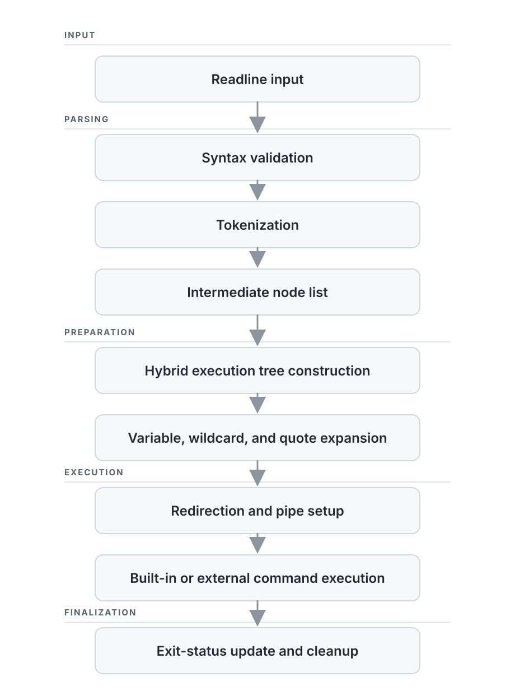

# Minishell

Minishell is a Unix shell written in C. It recreates a focused subset of Bash, including command execution, pipelines, redirections, environment expansion, built-ins, and interactive signal handling.

The core challenge was turning shell input into process execution: validating syntax, tokenizing, building an execution structure, expanding variables and wildcards, wiring file descriptors, and launching built-ins or external programs.

The project is part of the 42 curriculum and follows 42 constraints, including a limited allowed-function set and manual memory management.

## Features

- Interactive prompt with GNU Readline and command history
- External command execution through absolute paths, relative paths, or `PATH`
- Built-ins: `echo`, `cd`, `pwd`, `export`, `unset`, `env`, and `exit`
- Quote handling, environment expansion, `$?`, and wildcard expansion
- Redirections: `<`, `>`, `>>`, and `<<`
- Pipelines, logical operators, and parenthesized expressions
- Interactive signal handling and exit-status propagation

## Build and Run

Minishell requires a C compiler, GNU Make, and GNU Readline.

To compile and run the project:

```sh
make
./minishell
```

Representative commands:

```sh
echo "Hello, $USER"
ls -la | grep '.c' > sources.txt
cat < sources.txt | wc -l
false || echo "the previous command failed"
```

## Architecture

Each non-empty input line moves through the following stages:

<p align="center">
  <picture>
    <source media="(prefers-color-scheme: dark)" srcset="./minishell_pipeline_dark.svg">
    
  </picture>
</p>


### Hybrid Execution Tree

Minishell uses a hybrid AST-like execution tree because logical operators and pipelines have different execution semantics.

- `&&` and `||` are binary nodes connected through `left` and `right`.
- Pipeline stages form an ordered linked chain through `pipe`.
- Command arguments and redirections are stored in lists owned by each command node.
- `next` connects the intermediate node list used while constructing the final execution structure.

For example:

```sh
cat < input.txt | grep error && echo "errors found" || echo "no errors"
```

is represented approximately as:
```
                            OR
                          /    \
                        AND    echo "no errors"
                       /   \
                pipeline    echo "errors found"
                /      \
              cat    grep error
```

Expressed in terms of the actual pointers:

```text
OR
|-- left -> AND
|           |-- left -> CMD("cat")
|           |            input_list -> "input.txt"
|           |            pipe -> CMD("grep")
|           |                        args -> "error"
|           `-- right -> CMD("echo")
|                         args -> "errors found"
`-- right -> CMD("echo")
              args -> "no errors"
```

This structure was chosen because logical operators are conditional branches: the right side is evaluated only after inspecting the status of the left side. A pipeline, by contrast, is an ordered sequence whose stages must all be launched with connected file descriptors before the shell waits for them. Keeping pipeline stages in a chain makes that execution step iterative and direct.

The tradeoff is that traversal is not completely uniform: logical expressions are recursive, while pipelines are iterative. A more conventional alternative would use a dedicated pipeline node containing a list of stages, or binary `PIPE` nodes. The current representation instead lets the first command act as the pipeline head.

### Pipeline execution

For a pipeline such as:

```sh
A | B | C
```

the parser produces:

```text
A --pipe--> B --pipe--> C
```

The executor walks that chain, creates the required pipes, forks every stage, and wires standard input and output with `dup2`. It waits only after all stages have been started, preventing a producer from blocking forever while waiting for a consumer that has not yet been launched. The pipeline's resulting status is taken from its final command.

### Logical execution

Logical nodes are evaluated recursively. `&&` executes the right subtree only when the left subtree succeeds; `||` executes it only when the left subtree fails. Since `&&` and `||` share precedence, chains are constructed left-associatively, while pipelines bind more tightly.

## Project structure

```text
.
|-- check/        Syntax validation
|-- tokenise/     Lexical analysis
|-- parse/        Command nodes, redirection lists, and hybrid execution tree construction
|-- expansions/   Variables, wildcards, and quote removal
|-- execute/      Tree execution, pipelines, redirections, and built-ins
|-- initialise/   Shell and environment initialization
|-- misc_utils/   Shared utilities, diagnostics, and cleanup
|-- main.c        Read-evaluate loop
|-- minishell.h   Shared types and declarations
|-- Makefile      Build configuration
```

## Testing and debugging

We compared behavior against Bash across quoting, expansion, redirections, pipelines, logical operators, grouped expressions, signals, exit statuses, and error cases.

Memory behavior was checked with Valgrind. `rl_leak.txt` contains suppressions for known allocations retained by Readline and history:

```sh
valgrind --leak-check=full \
  --show-leak-kinds=all \
  --suppressions=rl_leak.txt \
  ./minishell
```

## Scope

Minishell implements the required 42 behavior plus additional features such as logical operators and parenthesized expressions, but it is not a complete POSIX or Bash interpreter.

Shell scripting, job control, background processes, command substitution, arithmetic expansion, functions, and advanced parameter expansion are outside its intended scope.

## What this project demonstrates

- Systems programming in C with explicit memory and file-descriptor management
- Process orchestration with `fork`, `execve`, `pipe`, `dup2`, and `waitpid`
- Parser design for shell grammar, including precedence, grouping, and execution order
- Careful handling of interactive behavior, error recovery, exit statuses, and representation tradeoffs

## Authors

- Marsha Teo
- [Raghda Yagoub](https://github.com/Raghda165)
